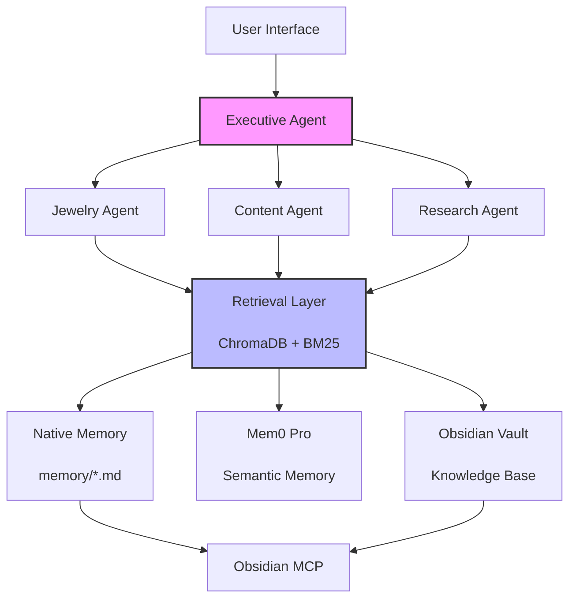

# MEMORY_ARCHITECTURE.md
# Complete Memory & Knowledge Infrastructure
# Personalized Learning & Memory Assistant (PLMA)
# Version: 1.0 | Date: 2026-06-19
# Author: Trapclaw (Executive AI Chief of Staff)

---

## TABLE OF CONTENTS

1. Executive Summary
2. Layer 1: OpenClaw Native Memory
3. Layer 2: Mem0 Pro Semantic Memory
4. Layer 3: Obsidian Knowledge Vault
5. Layer 4: Retrieval Layer
6. Layer 5: Agent Architecture
7. Layer 6: Startup Sequence
8. Architecture Diagram
9. Config Examples
10. Recommended Plugins
11. Recommended MCP Servers
12. Implementation Order
13. Potential Failure Points & Mitigations
14. Maintenance Procedures
15. Next Steps

---

## 1. EXECUTIVE SUMMARY

**PLMA** is a production-grade, multi-layered memory and knowledge architecture designed to transform OpenClaw from a stateless assistant into a persistent, learning operating system that improves over time.

### Design Principles

1. **Separation of Concerns** — Each layer has one job and does it well
2. **Redundancy with Purpose** — Critical info exists in multiple layers, each optimized for its use case
3. **Retrieval is King** — The best memory is useless if you can't find it when needed
4. **Incrementally Adoptable** — Build layer by layer, prove value at each step
5. **Human + Machine Readable** — Both you and the AI can read, edit, and reason about the system

---

## 2. LAYER 1: OPENCLAW NATIVE MEMORY

### Purpose
Ephemeral, session-specific context. Fast access, low latency. Immediate task state, recent conversation history, active project context.

### Folder Structure

```
memory/
├── MEMORY.md          # Curated long-term memory (distilled essence)
├── DREAMS.md          # Long-term goals, aspirations, vision
├── daily/             # Session logs (flight recorder)
│   ├── 2026-06-19.md
│   └── YYYY-MM-DD.md
├── projects/          # Per-project state and decisions
│   ├── jewelry-lister.md
│   ├── content-pipeline.md
│   └── template.md
├── business/          # Ongoing business operations
│   ├── jewelry-store.md
│   └── content-business.md
└── agents/            # Agent-specific configuration & context
    ├── executive.md
    ├── jewelry.md
    └── content.md
```

### File Templates

#### MEMORY.md

```markdown
# MEMORY.md

Updated: 2026-06-19

## Active Projects
- **[PROJECT-001] Jewelry AI Lister**: Build eBay listing automation.
  Status: In progress | Next: OAuth credentials
- **[PROJECT-002] Content Repurposer**: FFmpeg pipeline for short clips.
  Status: In progress | Next: Test with sample video

## Key Decisions (Immutable)
- **2026-06-19**: Use Mem0 Pro for long-term semantic memory.
- **2026-06-19**: Use ChromaDB for local vector storage.

## Learned Facts
- Boss prefers direct, no-fluff communication.
- Boss timezone: America/Los_Angeles.

## User Preferences
- Communication: Concise, action-oriented
- Code style: Minimal comments, clean logic
```

#### DREAMS.md

```markdown
# DREAMS.md

## 2026 Goals
- **Content Business**: $10k MRR by EOY
- **Jewelry Store**: Reduce listing time to <5 min/item

## Long-term Vision
- 80% of daily tasks managed by AI
- Fully autonomous content engine
- Jewelry store operations fully automated
```

#### memory/daily/YYYY-MM-DD.md

```markdown
# Session: YYYY-MM-DD

## Summary
- [What happened in this session]

## Key Decisions
- [Decision 1]
- [Decision 2]

## Action Items
- [ ] Incomplete task 1
- [x] Completed task 2

## New Memories to Consolidate
- [Fact or preference learned]
```

---

## 3. LAYER 2: MEM0 PRO SEMANTIC MEMORY

### What to Store in Mem0

| Category | Examples | Why |
|---|---|---|
| **User Preferences** | "Hates meetings on Monday", "Prefers Python over JS" | Personalizes all interactions |
| **Business Context** | "Average jewelry margin: 40%", "Primary audience: Gen Z" | Informs business decisions |
| **Learned Behaviors** | "Batches similar tasks", "Dislikes clarifying questions" | Optimizes interaction style |
| **Project History** | "eBay OAuth failed", "FFmpeg -ss -t works for clipping" | Prevents repeating mistakes |
| **Relationships** | "Vendor: GoldCo (reliable)", "Partner: @sarah" | Tracks external connections |

### What NOT to Store in Mem0

| Category | Examples | Where to Store Instead |
|---|---|---|
| **Secrets** | API keys, passwords, tokens | Secure vault (e.g., 1Password, Bitwarden) |
| **Raw Logs** | Full conversation transcripts | Git history, daily notes |
| **Transient Data** | Current session state, temp calculations | Session context (ephemeral) |
| **Large Structured Data** | Inventory lists, pricing tables | Supabase, Notion, Obsidian |

### Mem0 Categorization Schema

```json
{
  "memory_id": "mem-uuid",
  "content": "Boss prefers Python over JavaScript for scripting tasks",
  "category": "user_preference",
  "confidence": 0.95,
  "source": "conversation",
  "date_created": "2026-06-19T17:00:00Z",
  "last_accessed": "2026-06-19T17:00:00Z",
  "access_count": 3,
  "related_memories": ["mem-uuid-2"],
  "status": "active"
}
```

**Categories:**
- `user_preference` — How the user likes things done
- `business_context` — Facts about the businesses
- `learned_behavior` — Patterns in user behavior
- `project_history` — What worked, what didn't
- `relationship` — People, vendors, partners

### Retrieval Strategy

1. **On every user query:**
   - Extract keywords and intent from the query
   - Search Mem0 for semantically similar memories
   - Filter by category relevance (e.g., business queries → business_context)
   - Rank by confidence × recency × access_count
   - Inject top 3-5 memories into LLM context

2. **Retrieval parameters:**
   - `relevance_threshold`: 0.75 (tune based on noise tolerance)
   - `max_memories`: 5
   - `category_filter`: Auto-detect from query

### Memory Consolidation Workflow

**Weekly (automated):**
```
1. Find similar memories (cosine similarity > 0.85)
2. If identical: Keep most recent, archive older
3. If contradictory: Flag for user review, create resolved version
4. If stale (not accessed in 30 days): Move to "cold_storage" tag
5. Generate consolidation report → Add to weekly briefing
```

---

## 4. LAYER 3: OBSIDIAN KNOWLEDGE VAULT

### Purpose
Structured, human-readable knowledge. Source of truth for SOPs, research, prompt libraries, and detailed project documentation.

### Folder Hierarchy

```
Obsidian/
├── + Encounters/                 # Daily logs, fleeting notes (Zettelkasten)
│   └── 2026-06-19 - Session with Boss.md
│
├── + Source Notes/               # Literature, web captures, references
│   ├── 📄 eBay API Documentation.md
│   └── 📄 FFmpeg Cheatsheet.md
│
├── + Project Notes/              # Project-specific knowledge
│   ├── 📁 Jewelry AI Lister/
│   │   ├── Project Brief.md
│   │   ├── Technical Architecture.md
│   │   └── Decision Log.md
│   └── 📁 Content Repurposer/
│       ├── Project Brief.md
│       └── Technical Architecture.md
│
├── + Evergreen Notes/            # Permanent, refined knowledge
│   ├── AI Content Creation.md
│   ├── eCommerce Best Practices.md
│   └── Automation Principles.md
│
├── + Business/
│   ├── 📁 Jewelry Store/
│   │   ├── Dashboard.md
│   │   ├── 📁 SOPs/
│   │   │   ├── Photography.md
│   │   │   ├── Listing Creation.md
│   │   │   └── Pricing Strategy.md
│   │   ├── 📁 Inventory/
│   │   │   └── Current Stock.md (links to Supabase)
│   │   ├── 📁 Marketing/
│   │   │   ├── Email Templates.md
│   │   │   └── Social Media Calendar.md
│   │   └── 📁 Vendors/
│   │       └── GoldCo Contacts.md
│   └── 📁 Content Business/
│       ├── 📁 SOPs/
│       │   ├── Video Production.md
│       │   └── Content Repurposing.md
│       ├── 📁 Prompt Libraries/
│       │   ├── Image Generation.md
│       │   ├── Video Scripts.md
│       │   └── Social Media Captions.md
│       └── 📁 Content Calendar/
│           └── 2026 - Q3.md
│
├── + Research/                   # Deep dives, competitive analysis
│   ├── 📁 AI Tools/
│   │   └── Mem0 vs Pinecone.md
│   ├── 📁 Jewelry Market/
│   │   └── 2026 Trends.md
│   └── 📁 Content Strategy/
│       └── Viral Content Analysis.md
│
├── + Agents/                     # Agent configuration & context
│   ├── Executive Agent.md
│   ├── Jewelry Agent.md
│   ├── Content Agent.md
│   └── Research Agent.md
│
└── + Daily Notes/                # Symlinked from OpenClaw memory/daily
    └── (auto-populated)
```

### Note Templates

#### Project Brief Template

```markdown
# {{Project Name}}

## Status
- **Phase**: Discovery / Planning / In Progress / Complete / Archived
- **Health**: 🟢 On Track | 🟡 At Risk | 🔴 Blocked
- **Last Updated**: YYYY-MM-DD

## Objective
[One sentence: What are we trying to accomplish?]

## Context
[Why this matters, background, constraints]

## Key Decisions
| Date | Decision | Rationale |
|---|---|---|
| YYYY-MM-DD | [Decision] | [Why] |

## Next Steps
- [ ] [Task 1]
- [ ] [Task 2]

## Resources
- [Link to relevant notes]
```

#### SOP Template

```markdown
# {{SOP Title}}

## Purpose
[Why this SOP exists]

## Frequency
- [ ] One-time
- [ ] Daily
- [ ] Weekly
- [ ] As needed

## Prerequisites
- [Tool 1]
- [Tool 2]

## Steps
1. [Step 1]
2. [Step 2]

## Expected Output
[What the result looks like]

## Troubleshooting
| Issue | Solution |
|---|---|
| [Common issue] | [How to fix] |
```

---

## 5. LAYER 4: RETRIEVAL LAYER

### Evaluation Matrix

| Solution | Best For | Pros | Cons | Verdict |
|---|---|---|---|---|
| **QMD (Quick Markdown DB)** | Simple Obsidian queries | Easy setup, file-based | No semantic search, slow at scale | Not recommended for primary search |
| **ChromaDB** | Local vector storage | Fast, private, open source | Requires RAM for large datasets | **Recommended** |
| **LanceDB** | Embedded vector DB | Zero-config, persistent | Newer, smaller community | Good alternative |
| **BM25 + Embeddings** | Hybrid keyword + semantic | Best of both worlds | More complex to implement | **Best for accuracy** |
| **Mem0 Built-in** | Semantic memory only | Already integrated, works out of box | Less control over ranking | Good for Mem0-specific retrieval |

### Recommendation: Hybrid Retrieval (BM25 + Embeddings via ChromaDB)

**Why this wins:**
- **BM25** catches exact keyword matches ("eBay API rate limit")
- **Embeddings** catch conceptual similarity ("How do I list things faster?")
- **Combined** maximizes both precision and recall
- **ChromaDB** is local, fast, and private

### Implementation

```python
# Pseudocode for retrieval pipeline
def retrieve(query: str, context: str, max_results: int = 5) -> list[Document]:
    """
    Hybrid retrieval across all memory sources.
    
    Args:
        query: User's question or task
        context: Current session context (active project, agent, etc.)
        max_results: Maximum documents to return
    
    Returns:
        Ranked list of relevant documents from all layers
    """
    # Step 1: Search all layers in parallel
    native_results = search_native_memory(query)
    mem0_results = search_mem0(query)
    obsidian_results = search_obsidian(query)
    
    # Step 2: BM25 for keyword matches
    bm25_results = bm25_search(query, corpus=[native_results, obsidian_results])
    
    # Step 3: Semantic search
    semantic_results = chroma_db.similarity_search(query, k=max_results * 2)
    
    # Step 4: Merge and re-rank
    combined = merge_results(bm25_results, semantic_results)
    ranked = recency_boost(combined)  # Boost recent memories
    ranked = deduplicate(ranked)
    
    return ranked[:max_results]
```

### Indexing Strategy

| Source | Index Frequency | Method |
|---|---|---|
| OpenClaw native (`memory/*.md`) | On every write | Incremental |
| Obsidian vault | On startup, on Obsidian MCP sync | Full re-index if stale |
| Mem0 memories | Real-time (handled by Mem0) | N/A |

---

## 6. LAYER 5: AGENT ARCHITECTURE

### Agent Responsibility Matrix

| Agent | Responsibilities | Primary Tools | Memory Access |
|---|---|---|---|
| **Executive Agent** | Planning, orchestration, delegating, reporting | Calendar, Notion, all other agents | Native: RW, Mem0: R, Obsidian: R |
| **Jewelry Agent** | Inventory, listings, pricing, customer comms | eBay API, FB API, Shopify API, Supabase | Native: RW, Mem0: R, Obsidian: RW |
| **Content Agent** | Video, images, social, scheduling | OpenClaw, Hermes, Grok, FFmpeg, Cloudinary | Native: RW, Mem0: R, Obsidian: RW |
| **Research Agent** | Web research, trend analysis, deep dives | Web search, scraping, Grok | Native: R, Mem0: R, Obsidian: RW |

### Inter-Agent Communication Protocol

```
Executive Agent
    ├── can task → Jewelry Agent
    ├── can task → Content Agent
    └── can task → Research Agent (on behalf of above)

Jewelry Agent
    └── can request → Research Agent ("Find comparable sold listings")

Content Agent
    └── can request → Research Agent ("Find trending topics in AI art")

Research Agent
    └── returns findings → Requesting agent
```

---

## 7. LAYER 6: STARTUP SEQUENCE

### Complete Startup Workflow

```
┌─────────────────────────────────────────────────────────────────┐
│                    OPENCLAW STARTUP SEQUENCE                      │
│                     (Triggered on session start)                │
├─────────────────────────────────────────────────────────────────┤
│                                                                 │
│  PHASE 1: MEMORY INITIALIZATION                                 │
│  ┌─────────────────────────────────────────────────────────┐  │
│  │ 1.1 Load MEMORY.md into context window                    │  │
│  │     → Priority: CRITICAL (always first)                   │  │
│  │     → Validate: Check for corruption/missing sections     │  │
│  │                                                           │  │
│  │ 1.2 Load DREAMS.md into context window                    │  │
│  │     → Priority: HIGH (sets strategic direction)           │  │
│  │                                                           │  │
│  │ 1.3 Load active project notes (status: in_progress)       │  │
│  │     → Priority: HIGH (sets tactical context)              │  │
│  │     → Max: 3 most recently updated projects               │  │
│  └─────────────────────────────────────────────────────────┘  │
│                                                                 │
│  PHASE 2: KNOWLEDGE BASE SYNC                                   │
│  ┌─────────────────────────────────────────────────────────┐  │
│  │ 2.1 Check Obsidian vault last-modified timestamp          │  │
│  │     → If newer than last_sync: trigger incremental sync   │  │
│  │     → If >24h since last sync: trigger full sync          │  │
│  │                                                           │  │
│  │ 2.2 Obsidian MCP: List all modified files since sync      │  │
│  │     → Download new/modified notes to local cache            │  │
│  │     → Update file manifest                                  │  │
│  │                                                           │  │
│  │ 2.3 Verify critical files exist                             │  │
│  │     → Business/SOPs/*.md                                  │  │
│  │     → Agents/*.md                                          │  │
│  │     → If missing: flag in startup report                    │  │
│  └─────────────────────────────────────────────────────────┘  │
│                                                                 │
│  PHASE 3: RETRIEVAL INDEX REFRESH                               │
│  ┌─────────────────────────────────────────────────────────┐  │
│  │ 3.1 Check native memory files for changes                 │  │
│  │     → Re-index modified files in ChromaDB                 │  │
│  │                                                           │  │
│  │ 3.2 Check Obsidian cache for new/modified notes            │  │
│  │     → Re-index new/modified notes in ChromaDB             │  │
│  │                                                           │  │
│  │ 3.3 Verify ChromaDB index integrity                        │  │
│  │     → If corruption detected: rebuild from scratch          │  │
│  │     → Log index stats (doc count, avg embedding time)       │  │
│  └─────────────────────────────────────────────────────────┘  │
│                                                                 │
│  PHASE 4: MEM0 SYNC                                             │
│  ┌─────────────────────────────────────────────────────────┐  │
│  │ 4.1 Pull new memories from Mem0 since last session        │  │
│  │     → Add to context window (max 3 most relevant)         │  │
│  │                                                           │  │
│  │ 4.2 Check for pending memory consolidation                │  │
│  │     → Flag if >7 days since last consolidation            │  │
│  └─────────────────────────────────────────────────────────┘  │
│                                                                 │
│  PHASE 5: PROJECT STATE LOAD                                     │
│  ┌─────────────────────────────────────────────────────────┐  │
│  │ 5.1 Read active project files from memory/projects/       │  │
│  │     → Load into structured project objects                │  │
│  │                                                           │  │
│  │ 5.2 Verify project dependencies                          │  │
│  │     → e.g., eBay API creds for Jewelry AI Lister          │  │
│  │     → Flag missing dependencies in startup report         │  │
│  └─────────────────────────────────────────────────────────┘  │
│                                                                 │
│  PHASE 6: EXECUTIVE BRIEFING GENERATION                        │
│  ┌─────────────────────────────────────────────────────────┐  │
│  │ 6.1 Compile briefing:                                     │  │
│  │     → Active projects + status                            │  │
│  │     → Urgent/deadline items (next 24-48h)                 │  │
│  │     → New information learned since last session          │  │
│  │     → Recommended priorities for this session             │  │
│  │     → Blocked items + why                                 │  │
│  │                                                           │  │
│  │ 6.2 Display briefing on session start                       │  │
│  │     → Format: Markdown, scannable in <30 seconds          │  │
│  └─────────────────────────────────────────────────────────┘  │
│                                                                 │
│  PHASE 7: SELF-DIAGNOSTICS                                      │
│  ┌─────────────────────────────────────────────────────────┐  │
│  │ 7.1 Verify all layer connections                         │  │
│  │     → Mem0 API reachable?                                 │  │
│  │     → Obsidian MCP responsive?                            │  │
│  │     → ChromaDB operational?                               │  │
│  │                                                           │  │
│  │ 7.2 Log startup metrics                                     │  │
│  │     → Total startup time                                    │  │
│  │     → Context window utilization                          │  │
│  │     → Number of active projects                             │  │
│  └─────────────────────────────────────────────────────────┘  │
│                                                                 │
│              ✅ STARTUP COMPLETE — READY FOR TASKS              │
└─────────────────────────────────────────────────────────────────┘
```

### Executive Briefing Template

```markdown
# Executive Briefing — 2026-06-19

## Active Projects (3)
| ID | Project | Status | Next Step | Blocker |
|---|---|---|---|---|
| PJ-001 | Jewelry AI Lister | 🟡 In Progress | OAuth creds | Waiting on Boss |
| PJ-002 | Content Repurposer | 🟢 In Progress | Test pipeline | None |
| PJ-003 | Mem0 Integration | 🟢 In Progress | Configure categories | None |

## Urgent (Next 48h)
- ⏰ **eBay API creds expire in 3 days** — renew or listings stop
- 📊 Boss needs Q2 jewelry sales report

## New Since Last Session
- 💡 Learned: Boss prefers Notion over Google Docs for reports
- 🏷️ Memory added: "Prioritize automation over manual work"

## Recommended Priorities
1. **Unblock PJ-001** — Renew eBay API credentials
2. **Test PJ-002** — Run FFmpeg pipeline with sample video
3. **Generate report** — Q2 jewelry sales for Boss

## Blocked Items
- PJ-001: Waiting for eBay OAuth (see Urgent)

---
*Generated: 2026-06-19 08:00 PDT | Context: 4.2k/8k tokens | Mem0: 3 memories loaded*
```

---

## 8. ARCHITECTURE DIAGRAM

### ASCII Diagram

```
┌─────────────────────────────────────────────────────────────────────────┐
│                            USER INTERFACE                                │
│                      (Webchat, CLI, Telegram)                            │
└─────────────────────────────────────┬───────────────────────────────────┘
                                      │
┌─────────────────────────────────────▼───────────────────────────────────┐
│                         EXECUTIVE AGENT                                  │
│                 (Planning, Orchestration, Delegation)                    │
└────────────┬────────────┬────────────┬─────────────────┬─────────────────┘
             │            │            │                 │
    ┌────────▼───┐ ┌─────▼────┐ ┌────▼────┐  ┌─────────▼────────┐
    │   Jewelry  │ │  Content │ │Research │  │   Startup        │
    │   Agent    │ │   Agent  │ │  Agent  │  │   Orchestrator   │
    └─────┬──────┘ └────┬─────┘ └────┬────┘  └──────────────────┘
          │             │            │
          └─────────────┴────────────┘
                        │
    ┌───────────────────▼───────────────────┐
    │          RETRIEVAL LAYER            │
    │   (ChromaDB Vector Search + BM25)   │
    └──────────────┬──────────┬─────────────┘
                   │          │
    ┌──────────────▼──┐  ┌────▼─────────┐
    │  OpenClaw       │  │   Mem0       │
    │  Native Memory  │  │   Semantic   │
    │  (memory/*.md)  │  │   Memory     │
    └─────────────────┘  └──────────────┘
              │
    ┌─────────▼─────────┐
    │   Obsidian MCP    │
    │   Knowledge Vault │
    └───────────────────┘
```

### Mermaid Diagram (for documentation)



---

## 9. CONFIG EXAMPLES

### Mem0 Pro Configuration

```yaml
# mem0_config.yaml

api:
  base_url: "https://api.mem0.ai/v1"
  api_key: "${MEM0_API_KEY}"  # Load from env var

memory:
  embedding_model: "text-embedding-3-large"
  relevance_threshold: 0.75
  max_memories_per_query: 5
  categories:
    - user_preference
    - business_context
    - learned_behavior
    - project_history
    - relationship

  # Auto-tagging rules
  auto_tag:
    - pattern: "(?i)boss (likes|prefers|hates|wants)"
      category: "user_preference"
    - pattern: "(?i)(revenue|profit|margin|cost)"
      category: "business_context"
    - pattern: "(?i)(failed|error|bug|issue|worked)"
      category: "project_history"

  consolidation:
    enabled: true
    schedule: "0 0 * * 0"  # Weekly on Sunday
    similarity_threshold: 0.85
    archive_after_days: 30
```

### Obsidian MCP Configuration

```yaml
# obsidian_mcp_config.yaml

obsidian:
  vault_path: "/Users/boss/Documents/Obsidian/PLMA"
  daily_notes_folder: "+ Daily Notes"
  
  # Sync settings
  sync:
    mode: "incremental"  # incremental or full
    check_interval: "5m"   # How often to check for changes
    auto_sync_on_startup: true
    
  # Templates
  templates:
    daily_note: "templates/daily-note.md"
    project_brief: "templates/project-brief.md"
    sop: "templates/sop.md"
    
  # MCP Server settings
  mcp_server:
    port: 3001
    auth_token: "${OBSIDIAN_MCP_TOKEN}"
    
  # Indexing for retrieval layer
  indexing:
    enabled: true
    target_db: "chroma"
    include_folders:
      - "+ Evergreen Notes"
      - "+ Business"
      - "+ Project Notes"
      - "+ Research"
    exclude_patterns:
      - "*.png"
      - "*.jpg"
      - "*.pdf"
```

### ChromaDB Configuration

```python
# chroma_config.py

import chromadb
from chromadb.config import Settings

CHROMA_SETTINGS = {
    "persist_directory": "./data/chromadb",
    "anonymized_telemetry": False,
    "allow_reset": False,
}

def get_chroma_client():
    return chromadb.Client(Settings(**CHROMA_SETTINGS))

# Collection configuration
COLLECTION_CONFIG = {
    "name": "plma_knowledge",
    "metadata": {
        "description": "Unified knowledge base for PLMA",
        "created": "2026-06-19",
    }
}

# Embedding model
EMBEDDING_MODEL = "text-embedding-3-large"  # OpenAI
# Alternative: "all-MiniLM-L6-v2" for local

# Search configuration
SEARCH_CONFIG = {
    "n_results": 5,
    "distance_metric": "cosine",
}
```

### OpenClaw Native Memory Template

```yaml
# openclaw_memory_config.yaml

memory:
  base_path: "./memory"
  
  files:
    memory_md: "MEMORY.md"
    dreams_md: "DREAMS.md"
    
  daily_notes:
    enabled: true
    folder: "daily"
    template: "templates/daily-note.md"
    
  projects:
    folder: "projects"
    auto_archive_after_days: 90
    
  business:
    folder: "business"
    files:
      - "jewelry-store.md"
      - "content-business.md"
      
  agents:
    folder: "agents"
    files:
      - "executive.md"
      - "jewelry.md"
      - "content.md"
      - "research.md"

  # What to load on startup
  startup:
    critical_files:
      - "MEMORY.md"
      - "DREAMS.md"
    max_projects: 3
    max_memories: 5
```

---

## 10. RECOMMENDED PLUGINS

### For OpenClaw

| Plugin | Purpose | Priority |
|---|---|---|
| **Mem0 Plugin** | Semantic memory storage & retrieval | CRITICAL |
| **Obsidian MCP Plugin** | Vault sync and note access | CRITICAL |
| **Notion Plugin** | Task and project management | HIGH |
| **Telegram Plugin** | Bot interface for quick actions | HIGH |
| **Web Search** | Research agent capability | HIGH |
| **Calendar** | Scheduling, deadlines, reminders | MEDIUM |

### For Obsidian

| Plugin | Purpose | Priority |
|---|---|---|
| **Dataview** | Query notes like a database | HIGH |
| **Templater** | Dynamic note templates | HIGH |
| **Periodic Notes** | Daily/weekly note automation | MEDIUM |
| **QuickAdd** | Capture ideas quickly | MEDIUM |
| **CustomJS** | Run JavaScript in notes | LOW |

### For ChromaDB / Vector Search

| Tool | Purpose | Priority |
|---|---|---|
| **ChromaDB** | Local vector storage | CRITICAL |
| **Sentence Transformers** | Local embeddings (no API cost) | HIGH |
| **rank_bm25** | Keyword search component | HIGH |

---

## 11. RECOMMENDED MCP SERVERS

| MCP Server | Purpose | Status |
|---|---|---|
| **Obsidian MCP** | Read/write to Obsidian vault | Required — confirms installed |
| **Notion MCP** | Task tracking, project docs | Recommended |
| **Supabase MCP** | Database access for inventory | Required for Jewelry Agent |
| **Cloudinary MCP** | Asset upload/management | Required for Content Agent |
| **eBay API MCP** | Listing management | Required for Jewelry Agent |
| **Shopify MCP** | E-commerce operations | Recommended |
| **Google Calendar MCP** | Scheduling, deadlines | Recommended |
| **Email MCP** | Automated communication | Optional |

### MCP Server Configuration Template

```json
{
  "mcpServers": {
    "obsidian": {
      "command": "node",
      "args": ["/path/to/obsidian-mcp/dist/index.js"],
      "env": {
        "OBSIDIAN_VAULT_PATH": "/Users/boss/Documents/Obsidian/PLMA",
        "OBSIDIAN_MCP_TOKEN": "${OBSIDIAN_MCP_TOKEN}"
      }
    },
    "notion": {
      "command": "npx",
      "args": ["-y", "@notionhq/mcp-server"],
      "env": {
        "NOTION_API_KEY": "${NOTION_API_KEY}",
        "NOTION_DATABASE_ID": "${NOTION_DATABASE_ID}"
      }
    },
    "supabase": creatives": {
      "command": "node",
      "args": ["/path/to/supabase-mcp/dist/index.js"],
      "env": {
        "SUPABASE_URL": "${SUPABASE_URL}",
        "SUPABASE_ANON_KEY": "${SUPABASE_ANON_KEY}"
      }
    }
  }
}
```

---

## 12. IMPLEMENTATION ORDER

### Phase 0: Foundation (Week 1)

1. **Create folder structure** for all memory layers (memory/ dirs, Obsidian vault)
2. **Initialize MEMORY.md and DREAMS.md** with current state
3. **Install & configure Mem0 Pro plugin** in OpenClaw
4. **Set up Obsidian vault** with folder hierarchy and templates

### Phase 1: Native Memory + Mem0 (Week 2)

5. **Implement daily note automation** (auto-create on session start)
6. **Configure Mem0 categories and auto-tagging rules**
7. **Seed Mem0 with initial user preferences and business context**
8. **Test Mem0 retrieval** in conversation contexts

### Phase 2: Obsidian Integration (Week 3)

9. **Install & configure Obsidian MCP server**
10. **Create symlink** between `memory/daily/` and `Obsidian/+ Daily Notes/`
11. **Migrate existing notes** into Obsidian vault structure
12. **Create SOP templates** for both businesses

### Phase 3: Retrieval Layer (Week 4)

13. **Install ChromaDB** and configure embedding model
14. **Build indexing pipeline** for OpenClaw native + Obsidian
15. **Implement BM25 + embeddings hybrid search**
16. **Test retrieval accuracy** with sample queries

### Phase 4: Agent Architecture (Week 5-6)

17. **Define agent responsibilities and memory access rules**
18. **Implement inter-agent communication protocol**
19. **Build executive briefing generator**
20. **Deploy agents and test delegation flows**

### Phase 5: Startup Sequence (Week 7)

21. **Implement all 7 startup phases**
22. **Add error handling and recovery for each phase**
23. **Optimize startup time** (target: <5 seconds)
24. **Test with various failure scenarios**

### Phase 6: Polish & Scale (Week 8+)

25. **Add monitoring and metrics**
26. **Document all SOPs in Obsidian**
27. **Train user on interacting with the system**
28. **Iterate based on real-world usage**

---

## 13. POTENTIAL FAILURE POINTS & MITIGATIONS

| Failure Point | Risk | Impact | Mitigation |
|---|---|---|---|
| **Data Silos** | HIGH | Agents don't share info, duplicate work | Strict inter-agent communication protocol; shared memory layer |
| **Memory Bloat** | HIGH | Context window overflows, slow responses | Aggressive relevance filtering; auto-archive old memories; max 5 memories per query |
| **Obsidian Sync Failures** | MEDIUM | Knowledge base goes stale | Automatic sync checks on startup; manual sync command; sync status dashboard |
| **Mem0 API Outage** | MEDIUM | Semantic memory unavailable | Fallback to native memory; queue writes for retry; local embedding cache |
| **ChromaDB Corruption** | MEDIUM | Retrieval stops working | Automatic index backups; weekly integrity checks; rebuild from source capability |
| **Context Window Overflow** | HIGH | Lost context, poor responses | Prioritize memories by relevance; max 3-5 memories injected; use summaries |
| **Conflicting Memories** | MEDIUM | Contradictory info retrieved | Consolidation workflow flags conflicts; user review queue; version tracking |
| **Secret Leakage** | CRITICAL | API keys exposed in memory | NEVER store secrets in Mem0/Obsidian; use secure vault; regex scan for keys |
| **Agent Loop** | MEDIUM | Agents endlessly delegate | Max delegation depth (3 levels); timeout after 5 min; executive agent can kill loops |
| **Startup Timeout** | LOW | System unusable | Parallelize startup phases; cache aggressively; graceful degradation (skip non-critical) |

---

## 14. MAINTENANCE PROCEDURES

### Daily

- [ ] Review executive briefing on startup
- [ ] Check for sync errors (Obsidian, Mem0)
- [ ] Verify no PII/secrets leaked in daily notes

### Weekly

- [ ] Run Mem0 memory consolidation (automated, review conflicts)
- [ ] Archive stale memories (>30 days unused)
- [ ] Review and update active project notes
- [ ] Check ChromaDB index size and performance

### Monthly

- [ ] Audit agent performance (tasks completed, errors)
- [ ] Review and update SOPs in Obsidian
- [ ] Optimize vector database indexes (vacuum, reindex)
- [ ] Review memory architecture effectiveness
- [ ] Update DREAMS.md with progress

### Quarterly

- [ ] Full system review: Is the architecture still serving us?
- [ ] Assess need for new layers or agents
- [ ] Upgrade dependencies (ChromaDB, Mem0, MCP servers)
- [ ] Document lessons learned in Obsidian
- [ ] Plan next quarter's infrastructure roadmap

### Emergency Procedures

| Scenario | Action |
|---|---|
| Mem0 API down | Switch to native memory + Obsidian only; queue Mem0 writes |
| Obsidian vault corrupted | Restore from last backup; rebuild index from OpenClaw memory |
| ChromaDB corrupted | Rebuild from scratch (re-index all sources) |
| Context window constantly full | Reduce max memories; enable summarization; archive old projects |
| Agent sending conflicting tasks | Kill all agents; clear task queue; restart Executive Agent |

---

## 15. NEXT STEPS

1. **Boss Review:** Read this document; challenge any assumptions
2. **Phase 0 Start:** Create folder structure, init MEMORY.md + DREAMS.md
3. **Mem0 Setup:** Configure categories, test with sample memories
4. **Obsidian Setup:** Create vault, install plugins, create templates
5. **Proof of Concept:** Run through one full day with new system
6. **Iterate:** Refine based on real usage; nothing survives first contact

---

**This architecture is a living document. It will evolve as the system grows. The goal is not perfection on day one — it's sustainable improvement over time.**

*Document generated: 2026-06-19*
*Next review: 2026-07-19*
